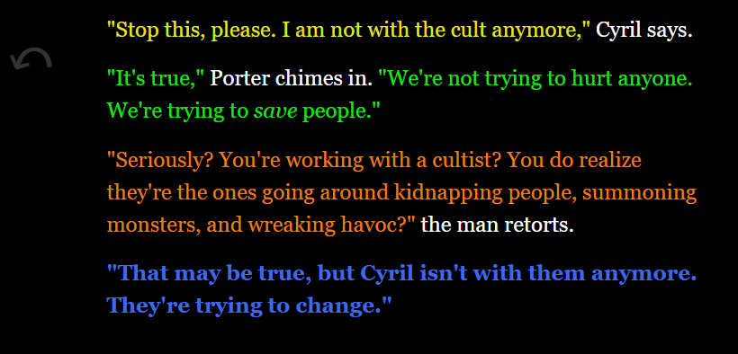

# smithwm210

Hello! My name is Will and I am a student at Worcester Polytechnic Institute in Massachusetts with a passion for game design. So far, I have finished two games in collaboration with other WPI students. I'm pursuing a Technology BS in Interactive Media and Game Development. I'm interested in all aspects of game development, with a primary focus on game programming and level design.

*CHANGE THIS* View my [resume](/Assets/Resume-SmithW.pdf)

Reach me at smithwm210@gmail.com

-------------------------------------

[Apocalypse: Green Wave](https://smithwm210.github.io/green-wave/Releases-builds/index.html)

Based on a simplified version of the Donkey Kong arcade game, Phuong Mai Do (pdo@wpi.edu), Aidan Bryar (afbryar@wpi.edu) and I collaborated on this project. Most of the art is from Mai, Aidan and I wrote the code, I made the music, and the final level design was by myself and Mai.

Created in Unity

Fall 2022

-------------------------------------

[Slid Not Stirred](https://smithwm210.github.io/slid-not-stirred/Releases-builds/index.html)

The winning game of IGDA WPI's Cutthroat Game Jam, which had the theme Don't Stop! As part of the Game Jam, we were given some fun restrictions like all sound effects originating from our voices, poorly translated subtitles, a prominent MS Paint animation, and more! Jacob Antepli (jaantepli@wpi.edu) was the lead programmer and designer, I contributed with programming and level design, and Sarah Bodkin (sbodkin@wpi.edu) and Zach Adams (zadams@wpi.edu) were the lead artists.

Created in Unity

April 2023

-------------------------------------

[Hollow Revival](https://smithwm210.github.io/hollow-revival/)

A character-focused narrative RPG made in two weeks. Me and three classmates created this text-based fantasy adventure with simple team combat mechanics where you must take down a cult! We each developed a character quest for a party companion you meet along the way. Cierra O'Grady (cmogrady@wpi.edu) was the lead programmer and writer for Quent. Owen Pugh (orpugh@wpi.edu) wrote Cyril. Elijah Delcastillo (eedelcastillo@wpi.edu) wrote Eri. I was the lead designer and writer for Porter.

Created in Twine

December 2023

